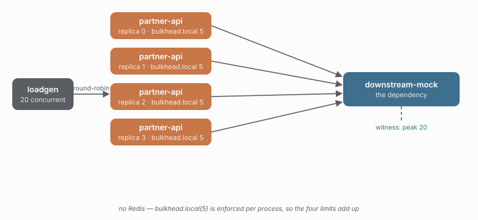

# 01 - Local policies, no Redis

> **Question:** What does a per-process limit mean when there are four processes?

```sh
npm run demo 01
```



## What it sets up

Four replicas of `partner-api`, each with `bulkhead.local({ limit: 5 })` and a local circuit breaker, and **no Redis anywhere**. One `downstream-mock` counts its own concurrency - that count is the witness, and it is the number this demo is about.

## The claim

`limit: 5` means five concurrent calls *per process*. Four processes means the dependency can still see **up to 20**. The `peakInFlightAtLeast` check asserts the witness saw more than a single process's limit; `peakInFlightAtMost` asserts it did not exceed four times the limit (plus scheduling noise).

```text
4 replicas x bulkhead.local({ limit: 5 })  ->  downstream peak ~ 20
```

Change `replicas` to `1` (and lower `peakInFlightAtLeast` to match) and re-run: the dependency now sees ~5 instead of ~20. That is the multiplication problem distributed policies exist to fix, shown from the dependency's point of view rather than argued about.

## What to watch in Grafana

- **Bulkhead occupancy** - four separate curves, each capped at 5, because each process enforces its own limit.
- **Breaker** - nothing happens: the dependency is healthy, and nothing sheds.

## The trap this demo *used to* hit (see docs/findings.md, finding 3)

`concurrency: 20` with `limit: 5` works here only because the load spreads to ~5 per replica, so the bulkhead rarely refuses. Push `concurrency` above `replicas x limit` and the bulkhead starts shedding - and against caracal `0.4.0` those rejections were classified as failures by the outer breaker, which then opened and shed everything under a different reason. That is the *wrong* reason for the breaker to open, and it is why the pipeline is the subject of this demo. `@gkoos/caracal@0.5.0` stopped counting a refusal the adapter never ran for, so the same override now sheds without touching the breaker; `npm run smoke:overload` asserts exactly that pair.

One caveat when reading the numbers: this study's absolute refusal count is host-sensitive - a slower or busier host holds permits longer, so more arrivals find the replica full. The recorded baseline (`82`) and `refusedAtMost` were calibrated on the author's machine; a host that sheds twice as many fails that check on `0.4.0` and `0.5.0` alike. `successRateAtLeast` is the machine-independent check.

## Compare with

```sh
npm run demo 02    # (M2) same workload, one shared budget
npm run compare 01 02
```

## Example run

Let's compare demo 01 and demo 02. First run both:

```bash
npm run demo 01
```

```
> caracal-sandbox@0.0.0 demo
> node --import tsx scripts/demo.mjs 01

downstream-mock on :4200 (latency 30ms, failureRate 0)
partner-api replica 0 on :4101 (local, scope global)
partner-api replica 3 on :4104 (local, scope global)
partner-api replica 1 on :4102 (local, scope global)
partner-api replica 2 on :4103 (local, scope global)

01-local-only - Local policies, no Redis
run 2026-09-14T22-22-55-810_01-local-only (4 replica(s), 15000ms)
  witness peak in-flight: 20
  client: 5880/5959 ok, refused {"bulkhead:capacity":79}, 0 timed out
  ok    the dependency reported its own concurrency  [present]
  ok    the dependency took at least 200 samples  [974]
  ok    the dependency saw at least 12 concurrent calls  [20]
  ok    the dependency never saw more than 24 concurrent calls  [20]
  ok    the run issued at least 500 requests  [5959]
  ok    at least 90% of calls succeeded  [98.7%]
  ok    at most 150 call(s) were refused by a policy  [79]
  ok    the failure opened the breaker exactly 0 time(s)  [0]

PASS - C:\projects\caracal-demo\runs/2026-09-14T22-22-55-810_01-local-only
```

```bash
npm run demo 02
```

```
> caracal-sandbox@0.0.0 demo
> node --import tsx scripts/demo.mjs 02

downstream-mock on :4200 (latency 30ms, failureRate 0)
partner-api replica 1 on :4102 (distributed, scope global)
partner-api replica 2 on :4103 (distributed, scope global)
partner-api replica 3 on :4104 (distributed, scope global)
partner-api replica 0 on :4101 (distributed, scope global)

02-distributed-basic - Same code, one shared budget
run 2026-09-14T22-23-22-655_02-distributed-basic (4 replica(s), 15000ms)
  witness peak in-flight: 5
  client: 1622/6478 ok, refused {"bulkhead:capacity":4856}, 0 timed out
  coordination: 2.5 trips/exec (16200 commands)
  ok    the dependency reported its own concurrency  [present]
  ok    the dependency took at least 200 samples  [981]
  ok    the dependency never saw more than 5 concurrent calls  [5]
  ok    the dependency saw at least 4 concurrent calls  [5]
  ok    the run issued at least 500 requests  [6478]
  ok    at least 100 rejection(s) with reason `capacity`  [4856]
  ok    the failure opened the breaker exactly 0 time(s)  [0]
  ok    at most 6 coordinator round trip(s) per execution  [2.5]
  ok    at least 80% of script calls were EVALSHA  [100.0%]

PASS - C:\projects\caracal-demo\runs/2026-09-14T22-23-22-655_02-distributed-basic
```

Then compare:

```bash
npm run compare 01 02
```

```
> caracal-sandbox@0.0.0 compare
> node --import tsx packages/caracal-runner/bin/compare.mjs 01 02

KPI                     01-local-only  02-distributed-basic  verdict
----------------------  -------------  --------------------  ---------------------------------------
witness peak in-flight  20             5                     02-distributed-basic (lower is better)
breaker opens           0              0                     same
peak probes in flight   0              0                     same
refused by a policy     79             4856                  01-local-only (lower is better)
success rate            98.7%          25.0%                 01-local-only (higher is better)
p99 latency             55ms           57ms                  01-local-only (lower is better)
throughput              396/s          430/s                 02-distributed-basic (higher is better)
requests                5959           6478
coordinator trips/exec  n/a            2.5                   n/a
lease lost              0              0                     same
checks                  8/8            9/9                   same
result                  pass           pass                  same
```

