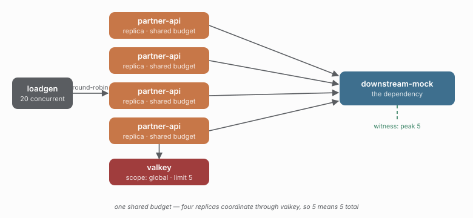

# 02 - Same code, one shared budget

> **Question:** What changes when the budget belongs to the downstream, not the process?

```sh
npm run demo 02
npm run compare 01 02
```



## What it sets up

Exactly what `01` sets up - four replicas, the same workload, the same healthy dependency - except for one line of configuration: the policies are **distributed** and the scope is `global`. The four replicas now coordinate through Redis, so `bulkhead.distributed({ limit: 5 })` means **five across the fleet**, not five per process.

## The claim

The dependency's own measurement drops from `01`'s ~20 to ~5, while the surplus is shed as `capacity` at the client instead of being pushed onto the dependency.

```text
4 replicas x bulkhead.local({ limit: 5 })        ->  downstream peak ~ 20
4 replicas x bulkhead.distributed({ limit: 5 })  ->  downstream peak ~ 5
```

The comparison is the point of the whole suite:

```sh
npm run compare 01 02
```

```text
KPI                     01-local-only  02-distributed-basic  verdict
witness peak in-flight  20             5                     02 (lower is better)
refused by a policy     ~100           ~4000                 the cost of shedding
success rate            ~98%           ~25%                  the honest tradeoff
coordinator trips/exec  0              ~4                     the cost of sharing
```

Two of those rows "lose" for 02, and they should: a shared budget costs throughput when the offer exceeds the budget - that is the budget working, not failing. The row that matters is the witness: a dependency whose real capacity is ~5 stays at ~5 instead of being overrun to 20.

## What to watch in Grafana

- **Bulkhead occupancy** - a single flat line at 5, not four separate ones.
- **Bulkhead rejections by reason** - a wall of `capacity`; shedding, not queueing.
- **Coordination health** - coordinator errors and degraded modes, if the fleet loses touch with Redis. (Round trips and the EVALSHA ratio are in `npm run compare`, not Grafana.)

## Compare with

```sh
npm run demo 03    # (M3) scope by region: a failure in one region stays regional
```
