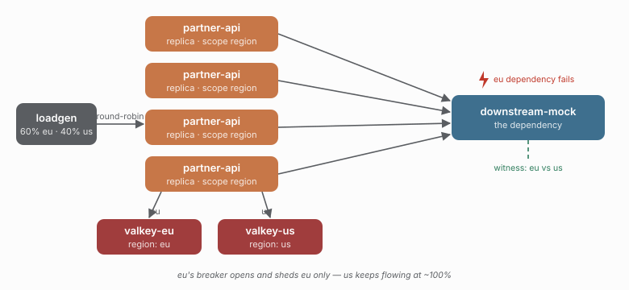

# 03 - A regional failure stays regional

> **Question:** Does a failure in one region stay in that region?

```sh
npm run demo 03
npm run demo 03 -- --live   # watch eu shed / us flow in Grafana
```



## What it sets up

Four distributed replicas, but this time the scope is `region:${region}` and the traffic is tagged `eu` (60%) and `us` (40%). The `eu` region also has **its own coordinator** (`REDIS_URL_REGION_EU` points at a second Valkey), so eu's breaker state and bulkhead budget live in a different Redis from us's.

Four seconds in, the eu *dependency* fails; at eleven seconds it recovers.

## The claim

The eu breaker opens and sheds eu traffic, while us - a different scope, a different breaker window - keeps flowing at ~100%. The witness (which counts per-region, because the replicas forward `x-region`) sees both, so the blast radius is measured rather than asserted.

```text
break eu  ->  breaker opens for scope region:eu, not region:us
```

This is the feature 02 could not show: `scope` is what makes "the failure domain matches the failure". One region's outage does not become a fleet-wide breaker.

## The follow-up this demo sets up but does not yet do

`REDIS_URL_REGION_EU` means eu's coordination is *physically* separate. Killing `valkey-eu` (eu's Redis) while eu is broken is the fail-open vs fail-closed demonstration, including the subtle retention rule - once a scope has been seen OPEN, a coordinator outage fails **closed** for that scope regardless of `onCoordinatorError`. That lands in the chaos demo (06), where killing Redis is already the subject.

## What to watch in Grafana

- **Breaker: state changes** - one scope's curve goes open then recovers, the other never moves.
- **Breaker rejections** - the shed traffic belongs to `region:eu` only.
- **Bulkhead occupancy** - two independent budgets, one per region.

## Compare with

```sh
npm run demo 04    # (M4) scope by tenant: one noisy tenant cannot spend another's budget
```
