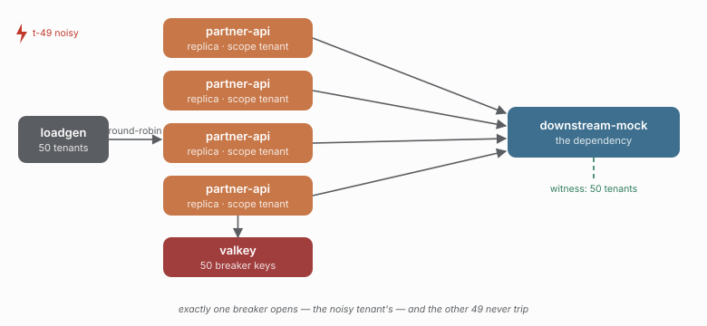

# 04 - One noisy tenant cannot spend another's budget

> **Question:** Does one tenant's failure stay in its own scope?

```sh
npm run demo 04
```



## What it sets up

Four distributed replicas, scoped by `tenant:${tenantId}`, serving 50 tenants. The dependency fails `t-49` on every call; the other 49 tenants are healthy. Each tenant gets its own breaker window and its own bulkhead budget (`limit: 5`).

## The claim

`t-49`'s breaker opens and sheds only `t-49`'s traffic. The other 49 tenants never trip. `scopesThatOpenedEquals: 1` is the whole argument in one number.

```text
50 tenants, 1 noisy  ->  exactly 1 breaker opens, and it is the noisy tenant's
```

This is the region demo's logic at the granularity where it matters in a SaaS: the failure domain is the *tenant*, so a noisy tenant cannot trip the breaker that protects everyone else.

## Cardinality: the tenant axis's own cost

50 tenants means 50 coordination identities. Look at what that costs:

```sh
docker compose -f stack/compose.yaml exec -T valkey valkey-cli --scan --pattern 'caracal:*' | wc -l
```

Each tenant is a breaker key (and, once it has ever been non-closed, a retained one - see the library's scope-retention note) plus a bulkhead key. And by default each tenant is also a `scope` label value in Prometheus, which is why the bridge ships `CARACAL_SCOPE_LABEL=off`: with 50 tenants that is fine, with 10 000 it is an operational problem, not a detail. The demo asserts `distinctScopesAtLeast: 40` so the cardinality is measured rather than assumed.

## What this demo deliberately does not do yet

The PostgreSQL permit-holding trap - a timed-out query keeps its distributed permit because `postgresAdapter` declares `abort: "unsupported"` - is a *capability* demonstration, not a blast-radius one, and is study `05`.

## Compare with

```sh
npm run demo 03    # scope by region: same mechanism, coarser failure domain
```
