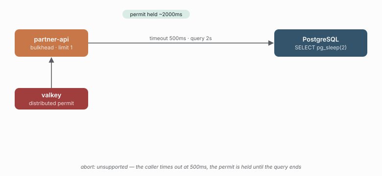

# 05 - A timed-out query still holds its permit

> **Question:** What does `abort: "unsupported"` mean for a distributed bulkhead?

```sh
npm run demo 05
```



## What it sets up

One replica, a `report.run` operation backed by `postgresAdapter` running `SELECT pg_sleep($1)`, a 500 ms timeout, and a distributed bulkhead with `limit: 1`. The load sends 2-second queries at 4/s with 4 concurrent callers.

## The claim

The caller gives up at 500 ms (`timeout.triggered`), but the permit is not released until the query actually settles at ~2 s. So:

```text
bulkhead.admitted  at t=0
timeout.triggered  at t=500ms      <- the caller has already moved on
bulkhead.released  at t=2000ms     <- the permit was held the whole time
```

`permitHoldAtLeast: 1500` is the claim in one number: a permit held for the full query duration, not the timeout. And because the permit was still held, the other concurrent callers were shed (`bulkhead.rejected`) even though their predecessors had all "timed out".

## Why it matters

`fetchAdapter` declares `abort: "supported"`, so a timeout *cancels* the request and frees the permit promptly. The `pg` query contract has no portable `AbortSignal` path, so `postgresAdapter` honestly declares `abort: "unsupported"` instead of pretending. The trap: a deadline that looks like it freed capacity did not - the database is still busy, and the permit is still gone. A burst of slow queries saturates the bulkhead for the full query duration, not the timeout.

This is the *capability* axis the fetch demos cannot show: the adapter's declared capabilities change what a timeout actually means.

## Follow-ups

- Compare with fetch: point the same demo at a slow *downstream* instead of `pg_sleep` and the permit is released at ~500 ms - that is the `abort` difference made measurable.
- `05` also sets up the observability demo: the "execution settled (failure) at 500 ms, attempt settled (success) at 2 s" signature is visible as a trace where the root span ends before its child attempt span.
