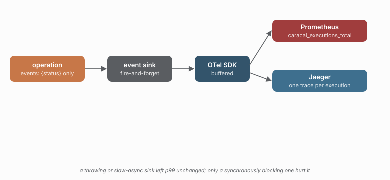

# 06 - Observability and cost

> **Question:** What does the observability path cost, and is it safe?

```sh
npm run observability
```

This one is a focused probe (`scripts/observability.mjs`), not a `study.yaml` scenario: the sink contract is a single-process measurement, not a multi-replica topology.



## The three claims

1. **One execution = one trace.** A retried execution is a single trace with an attempt span per retry and every policy decision as a span event - so a slow call reads as a story, not a counter.
2. **The sink is fire-and-forget.** A sink that throws, and a sink that takes 200ms *asynchronously*, leave p99 essentially unchanged (16.4/16.2ms vs 16.5ms baseline). Only a synchronously blocking sink hurts - and it is called once per event, so its cost multiplies by the number of events.
3. **Events carry `{status}` only.** No response body or error message reaches a sink.

The p99 numbers are the point of the demo: this probe observed no material p99 increase unless the sink blocks the caller, which is a property of caracal's `EventSink` contract, measured rather than asserted.
