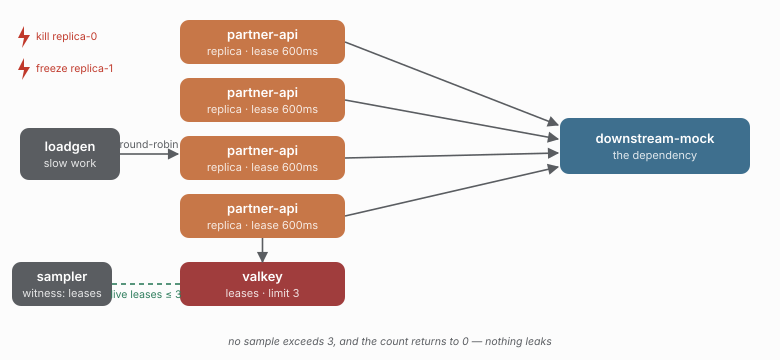

# 07 - The invariants hold while things die

> **Question:** Does the shared budget survive a killed worker and a frozen worker?

```sh
npm run demo 07
```



## What it sets up

Four distributed replicas sharing `bulkhead.distributed({ limit: 3, leaseMs: 600 })` over slow-ish (200ms) work. The witness this time is **Redis itself**: the orchestrator samples the live (non-expired) lease count on the coordinator's own clock every 50ms, entirely independent of the replicas and the load.

Three seconds in, a replica is `SIGKILL`ed mid-permit; two seconds later another is frozen for 1500ms - longer than its 600ms lease.

## The claims

```text
max live leases <= 3      in every 50ms sample, through the kill, the freeze, and everything else
final live leases == 0    nothing leaked
bulkhead.lease-lost >= 1  the frozen worker really did lose its lease
```

The kill shows lease expiry recovering an orphaned permit: the dead worker never releases, but its lease lapses and the slot comes back. The freeze shows the `lease-lost` path: with the event loop blocked, no renewal can fire, so the lease expires out from under the worker and it is aborted on wake-up.

## The honest caveat (from the library's own docs)

Leases are **not downstream fencing tokens**. A lease expiring means the *budget* recovers, not that the downstream stopped working - the frozen worker's 200ms call may well have completed server-side while its lease lapsed. This demo proves the budget invariant, not exactly-once execution; that distinction is the difference between "the limit holds" and "nothing was duplicated", and only the first is claimed.

## Not yet in this demo

- **Network partition** (toxiproxy in front of Redis): the bulkhead fails closed while the coordinator is unreachable.
- **State loss** (`DEL` the breaker/lease keys): the breaker mints a new generation and drops stale observations.

Both are wired in the runner (`replica.freeze`, `replica.kill`, `redis.state-loss`) and are natural follow-ups.
