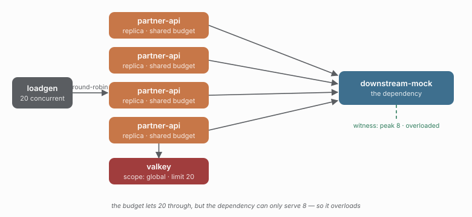

# 08 - A budget above capacity overloads the dependency

> **Question:** What happens when the budget lets more through than the dependency can serve?

```sh
npm run demo 08
npm run compare 02 08
```



## What it sets up

Study 02's distributed setup, with one difference each way: the budget is **20** instead of 5, and the dependency now has a real ceiling (`capacity: 8`). Beyond eight in-flight requests it refuses new ones with a 503, the way a saturated database or worker pool does.

## The claim

A budget is only worth having if it matches the dependency's capacity. Study 02's limit of 5 keeps the dependency at 5 — under its ceiling of 8 — so nothing fails. This study's limit of 20 lets the dependency reach its ceiling and then some, so the surplus is refused by the dependency itself:

```text
budget 5,  capacity 8  ->  dependency peak ~5, 0 overload failures
budget 20, capacity 8  ->  dependency peak ~8, thousands of 503s
```

The witness failures are the point: study 02's shedding is caracal refusing at the client (`capacity`); study 08's overload is the dependency itself failing. The first is a budget doing its job; the second is the budget being set wrong.

## Compare with

```sh
npm run compare 02 08    # same dependency, same workload, budget 5 vs 20
npm run demo 02          # the budget that fits
```

## What to watch in Grafana

- **Witness** - in-flight pinned at the dependency's ceiling (~8) instead of flat at 5.
- **Executions by outcome** - a wall of `failure`, versus study 02's wall of `bulkhead-rejected`.
- **Execution duration** - overloaded 503s resolve instantly, so latency looks fine while successful throughput drops.
