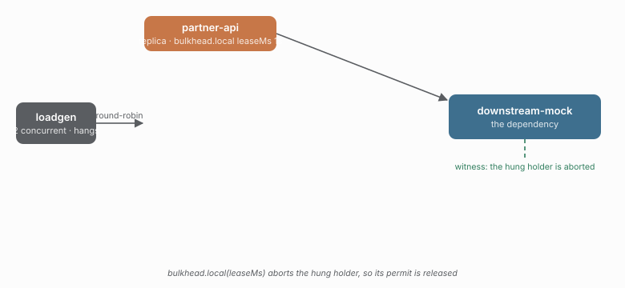

# 09 · A hung local holder is aborted after its lease

The local bulkhead's new `leaseMs` (caracal 0.6.0) is the counterpart to
[05's distributed gap](../05-distributed-lease). A fetch-backed operation with
`abort: "supported"` is aborted when it holds a permit longer than the lease,
so the permit is released and the next caller can be admitted.



## Run it

```sh
npm run demo 09
npm run demo 09 -- --duration=5000   # shorter
```

## What you'll see

`bulkhead.local({ limit: 1, leaseMs: 1000 })` admits one holder, the downstream
hangs, and after 1s the lease aborts the holder:

- `bulkhead.lease-lost` fires — the holder outlived its permit.
- `bulkhead.released` fires — the abort settled the fetch and freed the permit.

Without the lease (0.5.0) the single permit would be held by the hung holder
for the lifetime of the run, and every other caller would be shed.

## Checks

| check | what it proves |
| --- | --- |
| `bulkhead.lease-lost >= 3` | the lease reclaimed hung holders |
| `bulkhead.released >= 3`   | the abort released the permits |
