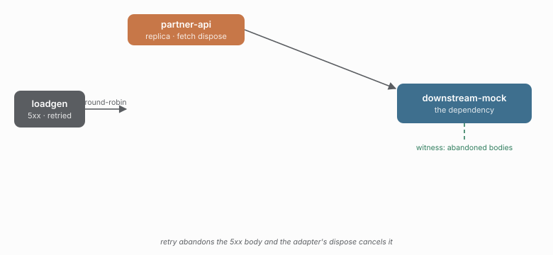

# 10 · Retry abandons a 5xx body and dispose cancels it

caracal 0.6.0 added `Adapter.dispose(outcome, context)`. When `retry` schedules
another attempt, the abandoned result is disposed rather than returned, so an
adapter can release a body or handle instead of leaking it. The fetch adapter
implements it by cancelling the abandoned response's body.



## Run it

```sh
npm run demo 10
```

## What you'll see

The dependency answers every call with a `500` but delays the body 500ms behind
the headers. `retry` reads the status, schedules the next attempt, and disposes
the first response's body:

- `retry.scheduled` fires — the 5xx was retried.
- the witness's `abandoned` count rises — the dependency saw the client cancel
  the response body before it was written.

Before 0.6.0 the discarded 5xx body stayed open until the run ended; now the
socket is released the moment the result is abandoned.

## Checks

| check | what it proves |
| --- | --- |
| `retry.scheduled >= 20`          | retries actually fired |
| `witnessAbandonedAtLeast >= 20`  | the abandoned bodies were cancelled |
