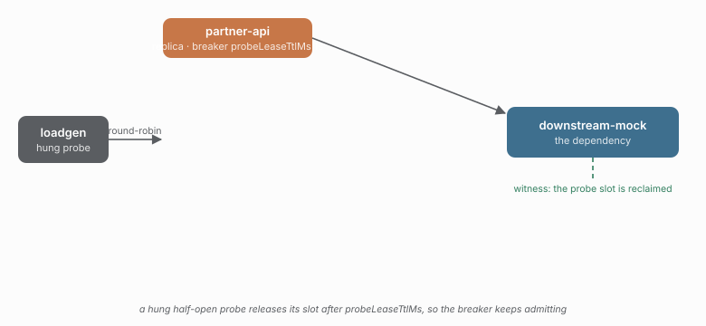

# 11 · A hung half-open probe releases its slot after the probe lease

caracal 0.6.0 armed the **local** circuit breaker's half-open probe with a lease
(`probeLeaseTtlMs`, default `openMs × 2`). This mirrors the distributed breaker's
existing probe lease: an adapter promise that never settles releases its slot
when the lease expires, and its late result is dropped as stale.



## Run it

```sh
npm run demo 11
```

## What you'll see

Every call hangs, so every request times out and opens the breaker. Once
half-open, each admitted probe also hangs — but the probe lease (1s) reclaims
the slot before the timeout (3s) would have settled it:

- `breaker.probe-started` keeps firing — half-open never wedged.
- `breaker.probe-expired` fires — the lease reclaimed each hung probe.

Before 0.6.0 a hung probe would have held the half-open slot forever, and the
breaker would stop admitting probes for the lifetime of the process.

## Checks

| check | what it proves |
| --- | --- |
| `breakerOpensEquals 1`          | the breaker opened via timeouts |
| `breaker.probe-started >= 3`    | half-open kept admitting probes |
| `breaker.probe-expired >= 3`    | the lease reclaimed the hung probes |
