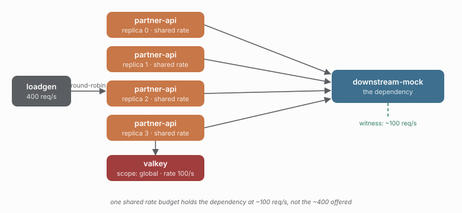

# 12 - One shared rate budget

> **Question:** What changes when the *rate* budget belongs to the downstream, not the process?

```sh
npm run demo 12
npm run compare 02 12
```



## What it sets up

Study 02's four-replica distributed setup, on the other axis. Study 02's bulkhead caps *concurrency* (how many calls are in flight); this study's `rateLimit.distributed({ rate: 100 })` caps *arrival rate* (how fast calls start). Four replicas share one rate budget through Redis, so the dependency sees ~100 req/s instead of the ~400 offered.

## The claim

The dependency's own request count sustains ~100 req/s, while the surplus is shed as `rate-exceeded` at the client. A rate limit is the axis next to the bulkhead's concurrency axis: one bounds *how many*, the other bounds *how fast*.

```text
4 replicas x bulkhead.distributed({ limit: 5 })    ->  dependency peak ~5      (02)
4 replicas x rateLimit.distributed({ rate: 100 })  ->  dependency rate ~100/s  (12)
```

The rate rows and the concurrency rows do not share a unit, so `compare 02 12` is the two axes side by side rather than a head-to-head: 02 holds the dependency at 5 *in flight*, 12 holds it at 100 *per second*.

## What to watch in Grafana

- **Downstream peak rps** - flat at ~100, not ~400.
- **Executions by outcome** - a wall of `rate-limited`, versus study 02's `bulkhead-rejected`.

## Compare with

```sh
npm run compare 02 12    # concurrency (bulkhead) vs rate (rate limit)
npm run demo 13          # rate is not a concurrency ceiling
```
