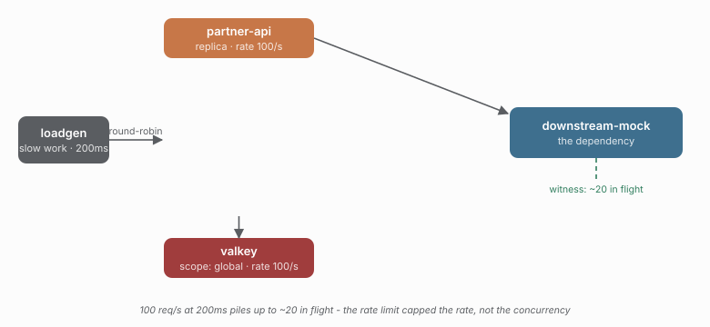

# 13 - Rate is not a concurrency ceiling

> **Question:** A rate limit caps arrival rate - what does it fail to protect when work is slow?

```sh
npm run demo 13
```



## What it sets up

One replica, a 200 ms dependency, and `rateLimit.distributed({ rate: 100 })` with the bulkhead effectively off. The rate limiter admits a steady 100 req/s; each admitted call then *holds* for 200 ms while it runs.

## The claim

Concurrency ≈ rate × latency. 100 req/s against a 200 ms dependency is ~20 calls in flight. The rate limit capped how fast calls *start* - it did nothing to cap how many pile up while they *run*. That is the bulkhead's job.

```text
rate 100/s, latency 30ms  ->  ~3 in flight   (rate + fast work: both under control)
rate 100/s, latency 200ms ->  ~20 in flight  (rate capped, concurrency ballooned)
```

A rate limit is not a concurrency ceiling. If the failure mode is "too many things running at once", you still need a bulkhead - which is why the two compose as *additional* policies rather than either/or.

## What to watch in Grafana

- **Downstream peak in-flight** - climbs to ~20 while the rate stays flat at ~100/s.
- **Downstream peak rps** - flat at ~100, showing the rate limiter did its half of the job.

## Compare with

```sh
npm run demo 12          # one shared rate budget (fast work: rate is the whole story)
npm run demo 02          # the bulkhead that would have capped the concurrency
```
