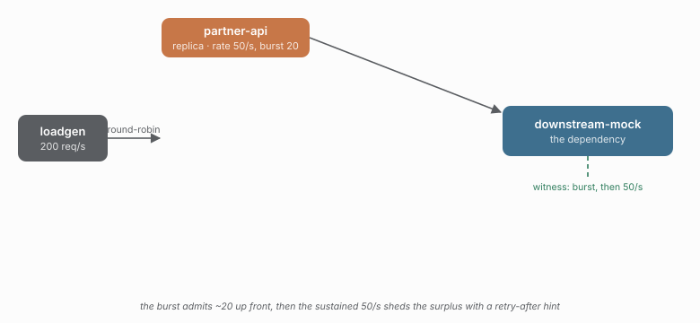

# 14 - Burst, then the sustained rate - with a retry-after hint

> **Question:** What does `burst` buy, and what does a rate-exceeded rejection tell you?

```sh
npm run demo 14
```



## What it sets up

One replica, `rateLimit.local({ rate: 50, burst: 20 })`, offered 200 req/s. GCRA keeps one number - the theoretical arrival time of the next call - and `burst` is how far ahead of schedule an arrival may be before it is rejected.

## The claim

The first ~20 calls are admitted back to back (the burst); after that the limiter enforces the sustained 50 req/s and sheds the surplus as `rate-exceeded`. Every rejection carries `retryAfterMs` - when the next call would be admissible - so a caller can pace a retry instead of guessing:

```ts
retry({
  maxAttempts: 3,
  delay: (attempt, ctx) =>
    ctx.error instanceof RateLimitExceededError ? ctx.error.retryAfterMs : 0,
})
```

```text
rate 50/s, burst 20  ->  ~20 admitted up front, then 50/s
                         surplus shed, each with a retry-after hint
```

## What to watch in Grafana

- **Downstream peak rps** - a spike for the burst, then flat at ~50.
- **Executions by outcome** - a wall of `rate-limited` after the burst.

## Compare with

```sh
npm run demo 12          # the distributed version of the same budget
```
