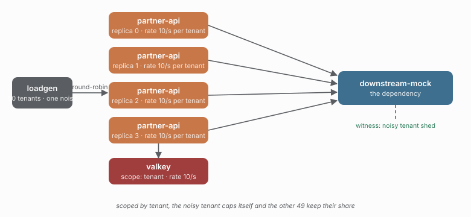

# 15 - Per-tenant rate quota

> **Question:** Does one noisy tenant exhaust the shared rate, or does each tenant get its own?

```sh
npm run demo 15
```



## What it sets up

Four replicas, 50 tenants, and `rateLimit.distributed({ rate: 10 })` scoped by tenant. One tenant is over-represented in the traffic mix, so its share of the rate is exhausted first.

## The claim

Scoping the rate limit by tenant gives every tenant its own 10 req/s. The noisy tenant's excess is shed as `rate-exceeded` on *its* scope, while the other 49 tenants keep their share untouched - the rate-axis analog of study 04's breaker isolation.

```text
scope: global          ->  one 10 req/s budget for everyone (one noisy tenant starves all)
scope: tenant:<id>     ->  50 x 10 req/s budgets (the noisy tenant caps itself)
```

## What to watch in Grafana

- **Rate-limit rejections by scope** - all of them on `tenant:noisy`.
- **Distinct scopes** - 50 coordination keys, the cardinality a per-tenant scope costs.

## Compare with

```sh
npm run demo 04          # the same boundary on the breaker axis (tenant isolation)
```
